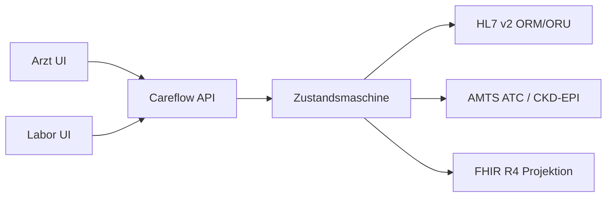

# Careflow

Klinischer **Stationsarbeitsplatz** (CPOE) für das fiktive Musterklinikum Nord: Laborauftrag, Befundrücklauf, AMTS, HL7 v2 und FHIR R4. Nur synthetische Demodaten.

Spring-Boot-Backend und React/TypeScript-UI in einem Repository; der UI-Build liegt im JAR unter `/`.

[](https://github.com/mdacoding/careflow/actions/workflows/ci.yml)
[](https://render.com/deploy?repo=https://github.com/mdacoding/careflow)


## 5-Minuten-Demo

1. **Dr. med. Lena Weber** (Passwort `demo`).
2. **Elena Krüger** — Bett 12, Allergie Penicillin, Verdacht Pneumonie.
3. Laborauftrag **Blutbild + CRP** → `ORM^O01` plus ACK.
4. Rolle Labor: annehmen, **Befund freigeben** → `ORU^R01`.
5. CRP pathologisch. **Amoxicillin** → AMTS-Sperre (ATC-Hierarchie J01C).
6. **Cefuroxim** → Hinweis Kreuzallergie β-Laktam. Ansicht **HL7 / FHIR**.

Optional zweiter Fall: **Karl-Heinz Vogt**, Herzinsuffizienz NYHA III. **Ibuprofen** → AMTS-Hinweis NSAR; Niere über CKD-EPI, sobald Kreatinin befundet ist.

Kennungen: `weber` Ärztin, `hoffmann` MTA, `schmidt` Pflege — Passwort `demo`. RBAC: Pflege ohne CPOE.

## Live-Demo

Noch keine öffentliche Instanz: `careflow.onrender.com` antwortet mit 404, solange das Render-Blueprint nicht verbunden ist. Deploy auf Render Free:

[](https://render.com/deploy?repo=https://github.com/mdacoding/careflow)

Nach dem Deploy (Render Free schläft nach Idle; erster Request dauert länger; H2 startet leer, Seeder legt sechs Fälle an):

| Einstieg | Pfad |
|---|---|
| Stationsarbeitsplatz | `/` |
| FHIR Patient | `/fhir/Patient?_format=json` |
| FHIR Observation | `/fhir/Observation?patient={id}&_format=json` |
| OpenAPI | `/swagger-ui.html` |
| Health | `/actuator/health` |

Akte zeigt Kreatinin/eGFR; Interop das Audit-Protokoll.

## Tech-Stack

**Backend**
- Java 21, Spring Boot 3.4 (Web, WebSocket, Security/RBAC, Data JPA, Validation, Actuator)
- Flyway, Hibernate (`ddl-auto: validate`), Optimistic Locking (`@Version` auf Aufträgen)
- H2 im Demo-Betrieb, PostgreSQL 16 lokal per Docker Compose
- springdoc-openapi

**Interop**
- HAPI HL7 v2.5: `ORM^O01`, `ORU^R01`, `ACK` (PipeParser, ohne Validating)
- HAPI FHIR 7.6 R4 RestfulServer: Patient, Encounter, AllergyIntolerance, ServiceRequest, Observation, DiagnosticReport, MedicationRequest
- FHIR Collection-Bundle je Akte unter `/api/patients/{id}/fhir`

**Fachlogik**
- Auftrags-Zustandsmaschine (LAB: PLACED → IN_LAB → RESULTED; MED: ACTIVE / BLOCKED)
- Storno: LAB in PLACED/IN_LAB und MED in ACTIVE → CANCELLED
- Optimistic Locking sichtbar als HTTP 409 `OPTIMISTIC_LOCK`
- AMTS-Regelengine: ATC-Hierarchie (Allergie-Prefix, chemische 5-Stellen-Gruppe), Kreuzallergie J01C/J01D, NSAR bei Herzinsuffizienz
- Niere: CKD-EPI Kreatinin 2021 (ohne Race), NSAR-Block bei eGFR unter 30, Warnung unter 60
- Befundflags HL7 0078 (N/L/H/LL/HH) inkl. LOINC-Panic-Grenzen
- Offene Doppel-Laboraufträge und überlappende Panels (BBCRP ⊃ BB/CRP): HTTP 409
- Stationsboard, Akte und Labor-Worklist in einem Roundtrip (kein N+1)

**Frontend**
- React 19, TypeScript, Vite 6
- Produktionsbuild im selben JAR
- WebSocket-Ereignisse in der UI; HL7-Storno als ORM CA

**Qualität / Betrieb**
- JUnit 5: ATC, CKD-EPI, Referenzbereich, Zustandsmaschine/Storno, HL7-Roundtrip, API (AMTS-Sperre, RBAC, Overlap 409, SameSite-Cookie, Kreatinin/eGFR, Audit-DTO, FHIR `?patient=`)
- GitHub Actions (CI grün): Temurin 21, Node 22, Free Runner
- Docker Multi-Stage; Render Free, ein Dienst, H2 im Speicher

Kein Kafka, kein Keycloak, keine bezahlte Arzneimittel-DB.

## Architektur



Eine Akte, drei Sichten: Station, Labor, Schnittstelle. FHIR ist Projektion, nicht zweites Primärsystem.

## Lokal starten

```bash
./mvnw spring-boot:run
cd frontend && npm install && npm run dev
```

UI: http://localhost:5173 — API: http://localhost:8080/swagger-ui.html

UI im JAR:

```bash
cd frontend && npm run build
./mvnw spring-boot:run
```

http://localhost:8080

## Tests

```bash
./mvnw -B test
cd frontend && npm run build
```
