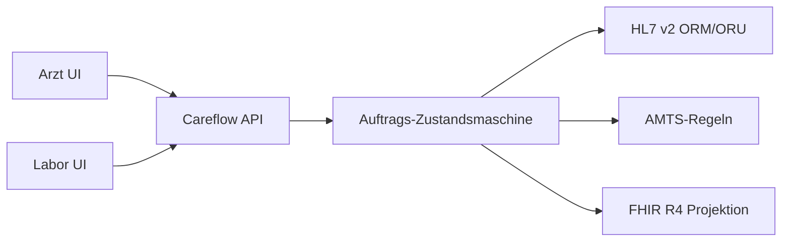

# Careflow

Klinischer **Stationsarbeitsplatz** für das fiktive Musterklinikum Nord: Auftragswesen, Laborbefund, AMTS-Prüfung, HL7 v2 und FHIR R4. Nur synthetische Demodaten, kein Arbeitgeber- und kein Patientenbezug.

Unabhängige Fullstack-Anwendung: Spring-Boot-Backend und React/TypeScript-UI im selben Repository. Der Produktionsbuild liegt im Spring-JAR und wird unter `/` ausgeliefert.

[](https://github.com/mdacoding/careflow/actions/workflows/ci.yml)
[](https://careflow.onrender.com)


## 5-Minuten-Demo

1. **Dr. med. Lena Weber** wählen (Passwort `demo`).
2. **Elena Krüger** öffnen (Bett 12, Penicillin-Allergie, Pneumonie-Verdacht).
3. **Blutbild + CRP** anordnen — es entsteht `ORM^O01` plus ACK.
4. Oben auf **Labor** wechseln (oder Rolle MTA) und **Befund freigeben**.
5. CRP ist pathologisch. **Amoxicillin** auslösen — AMTS sperrt wegen Allergie.
6. **Cefuroxim** wählen (Hinweis Kreuzallergie) und unter **Interop** HL7 + FHIR-Bundle zeigen.

Kennungen: `weber` (Ärztin), `hoffmann` (Labor), `schmidt` (Pflege) — Passwort jeweils `demo`.

## Live-Demo

| Einstieg | URL |
|---|---|
| Stationsarbeitsplatz | https://careflow.onrender.com |
| FHIR Patient | https://careflow.onrender.com/fhir/Patient?_format=json |
| OpenAPI | https://careflow.onrender.com/swagger-ui.html |
| Health | https://careflow.onrender.com/actuator/health |

Render Free schläft nach Inaktivität; der erste Request danach dauert länger. H2 startet leer und wird mit sechs Stationsfällen befüllt.

[](https://render.com/deploy?repo=https://github.com/mdacoding/careflow)

## Tech-Stack

**Backend**
- Java 21, Spring Boot 3.4 (Web, WebSocket, Security, Data JPA, Validation, Actuator)
- HAPI FHIR 7.6 (R4 RestfulServer) und HAPI HL7 v2.5 (`ORM^O01`, `ORU^R01`, `ACK`)
- Eigene AMTS-Regelengine (Allergie, Kreuzreaktion, Doppel-ATC, NSAR)
- Flyway, Hibernate; H2 im Demo-Betrieb, PostgreSQL 16 lokal per Docker Compose
- springdoc-openapi

**Frontend**
- React 19, TypeScript, Vite 6 in `frontend/`
- Produktionsbuild im selben Spring-JAR unter `/`

**Tests / CI**
- JUnit 5: Regelengine, Zustandsmaschine, HL7-Roundtrip, API inkl. AMTS-Sperre
- GitHub Actions: Backend `./mvnw -B test` (Temurin 21), Frontend `npm ci && npm run build` (Node 22)

**Betrieb**
- Docker Multi-Stage: Node 22 baut die UI, Maven (Temurin 21) packt das JAR
- Render Free: ein Web-Service aus dem Dockerfile, H2 im Speicher

## Architektur



- **Station** sieht Fälle, Allergien, offene Aufträge.
- **Arzt** erzeugt Laboraufträge und Medikation; Laboraufträge gehen als HL7 `ORM^O01` raus.
- **Labor** arbeitet eine Worklist ab und liefert `ORU^R01` inkl. LOINC-Werte.
- **AMTS** prüft vor der Verordnung; Block endet als HTTP 409 mit Regel-ID.
- **FHIR** ist eine Projektion derselben Akte, kein zweites Wahrheitssystem.

## Lokal starten

Zwei Terminals, Java 21 und Node 22:

```bash
./mvnw spring-boot:run
cd frontend && npm install && npm run dev
```

UI: http://localhost:5173  
API/OpenAPI: http://localhost:8080/swagger-ui.html

Ohne Frontend-Devserver, UI im JAR:

```bash
cd frontend && npm run build
./mvnw spring-boot:run
```

Dann http://localhost:8080

## Tests

```bash
./mvnw -B test
cd frontend && npm run build
```
