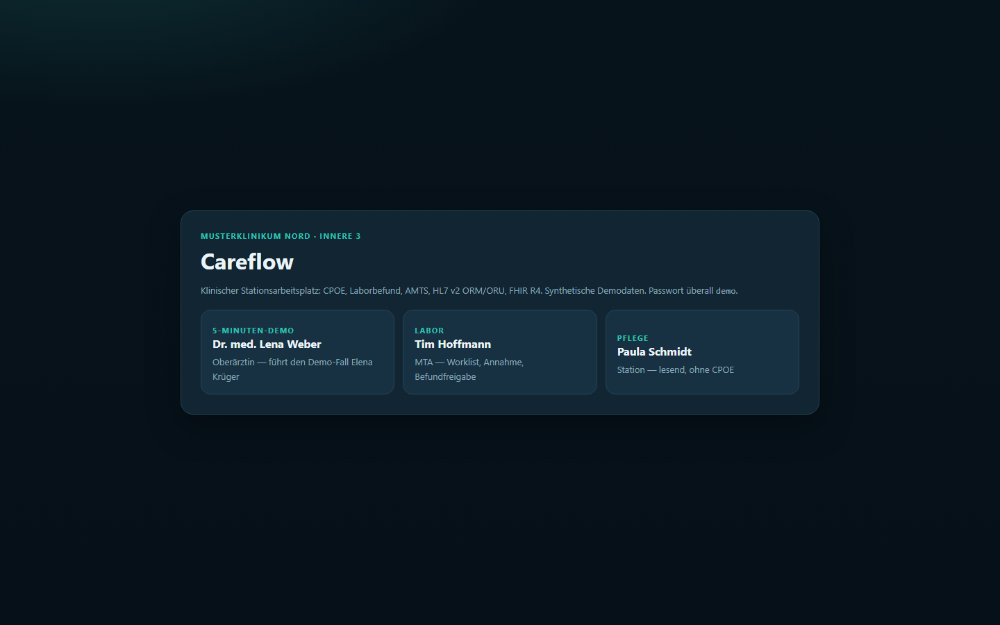
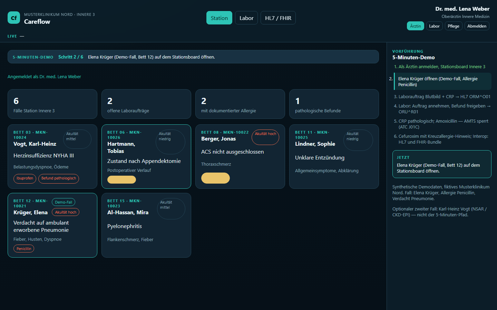
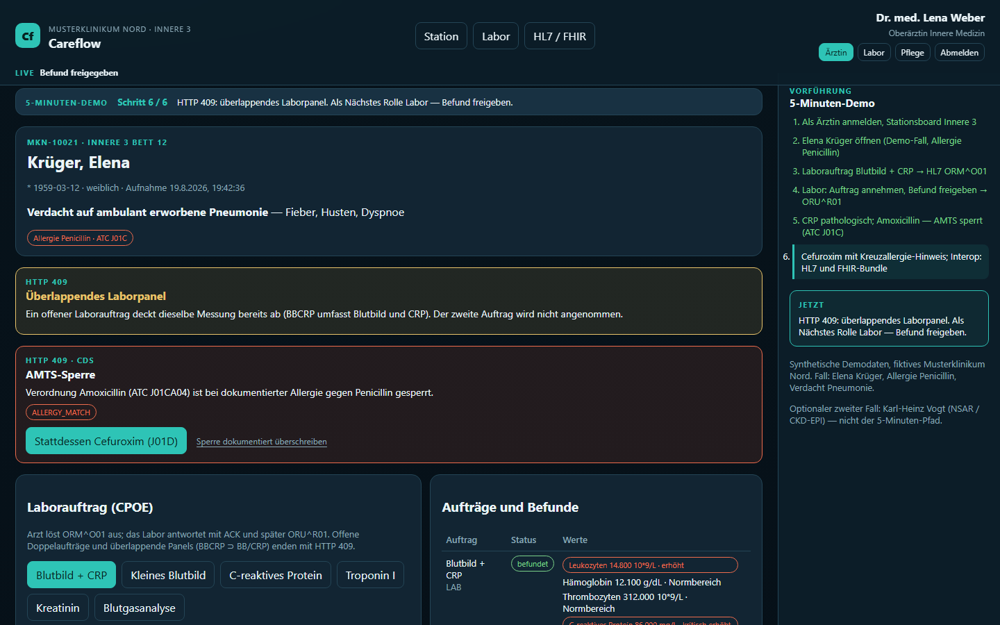
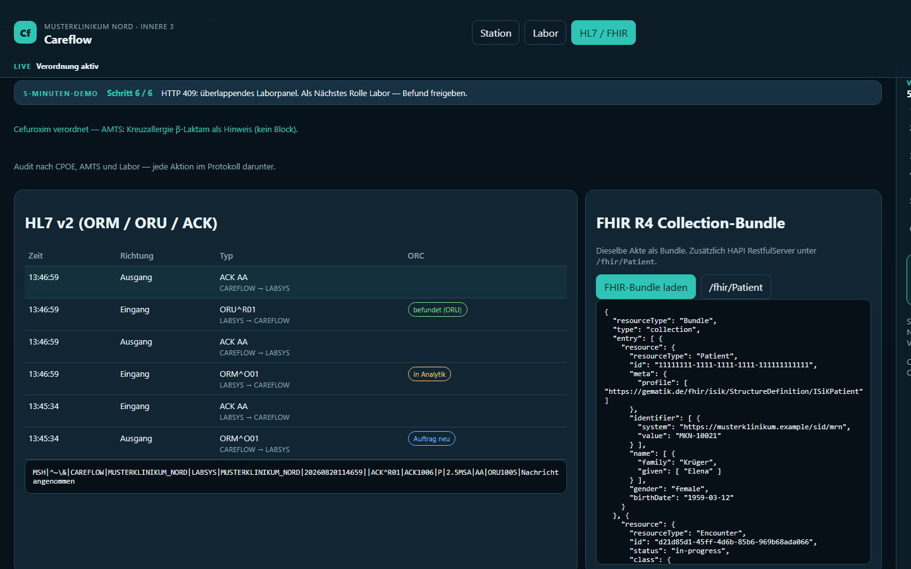
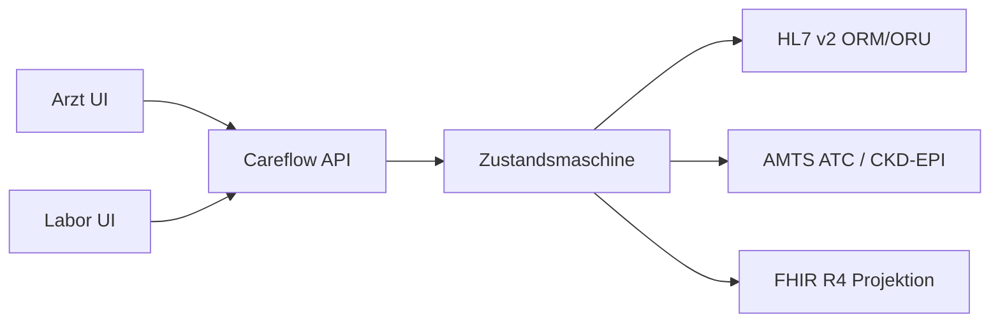

# Careflow

Klinischer **Stationsarbeitsplatz** (CPOE) für das fiktive Musterklinikum Nord: Laborauftrag, Befundrücklauf, AMTS, HL7 v2 und FHIR R4. Nur synthetische Demodaten.

Spring-Boot-Backend und React/TypeScript-UI in einem Repository; der UI-Build liegt im JAR unter `/`.

[](https://github.com/mdacoding/careflow/actions/workflows/ci.yml)
[](https://careflow.onrender.com)


## 5-Minuten-Demo

1. **Dr. med. Lena Weber** (Passwort `demo`).
2. **Elena Krüger** — Bett 12, Allergie Penicillin, Verdacht Pneumonie.
3. Laborauftrag **Blutbild + CRP** → `ORM^O01` plus ACK.
4. Rolle Labor: annehmen, **Befund freigeben** → `ORU^R01`.
5. CRP pathologisch. **Amoxicillin** → AMTS-Sperre (ATC-Hierarchie J01C).
6. **Cefuroxim** → Hinweis Kreuzallergie β-Laktam. Ansicht **HL7 / FHIR**.

Optional zweiter Fall: **Karl-Heinz Vogt**, Herzinsuffizienz NYHA III. **Ibuprofen** → AMTS-Hinweis NSAR; Niere über CKD-EPI, sobald Kreatinin befundet ist.

Kennungen: `weber` Ärztin, `hoffmann` MTA, `schmidt` Pflege — Passwort `demo`. RBAC: Pflege ohne CPOE.

## Screenshots

Synthetische Demo, aufgenommen lokal.

| Login | Station Innere 3 |
|---|---|
|  |  |
| **AMTS-Sperre** Elena / Penicillin | **Interop** HL7 v2 + FHIR R4 |
|  |  |

Akte und Labor-Worklist: `docs/screenshots/03-akte-elena.png`, `docs/screenshots/04-labor.png`.

## Live-Demo

Öffentliche Demo auf Render Free: **https://careflow.onrender.com**

Render Free schläft nach Idle. Der **erste Request** danach kann **30–60 Sekunden** dauern (Cold Start) — das ist kein Fehler. Danach Login-Seite Musterklinikum Nord. H2 startet leer; der Seeder legt sechs Fälle an.

Kennungen (Passwort überall `demo`): `weber` Ärztin, `hoffmann` MTA, `schmidt` Pflege. RBAC: Pflege ohne CPOE.

5-Minuten-Pfad auf der Live-Instanz: **Dr. med. Lena Weber** → **Elena Krüger** (Bett 12) → Laborauftrag **Blutbild + CRP** → Rolle Labor, Befund freigeben → **Amoxicillin** (AMTS-Sperre) → **Cefuroxim** → Ansicht **HL7 / FHIR**.

| Einstieg | URL |
|---|---|
| Stationsarbeitsplatz | https://careflow.onrender.com/ |
| FHIR Patient | https://careflow.onrender.com/fhir/Patient?_format=json |
| FHIR Observation | https://careflow.onrender.com/fhir/Observation?patient={id}&_format=json |
| FHIR metadata | https://careflow.onrender.com/fhir/metadata?_format=json |
| OpenAPI | https://careflow.onrender.com/swagger-ui.html |
| Health | https://careflow.onrender.com/actuator/health |

Akte zeigt Kreatinin/eGFR; Interop das Audit-Protokoll.

## Tech-Stack

**Backend**
- Java 21, Spring Boot 3.4 (Web, WebSocket, Security/RBAC, Data JPA, Validation, Actuator)
- Flyway, Hibernate (`ddl-auto: validate`), Optimistic Locking (`@Version` auf Aufträgen)
- H2 im Demo-Betrieb, PostgreSQL 16 lokal per Docker Compose
- springdoc-openapi

**Interop**
- HAPI HL7 v2.5: `ORM^O01` (ORC NW / SC / CA), `ORU^R01` (ORC CM), `ACK` (PipeParser, ohne Validating)
- Ausgang ORM NW/CA von CAREFLOW, Eingang SC/ORU von LABSYS, ACK jeweils vom Empfänger. FHIR-Suche gebatched.
- HAPI FHIR 7.6 R4 RestfulServer als Lese-Projektion (Search/Read/metadata), kein Create: Patient, Encounter, AllergyIntolerance, ServiceRequest, Observation, DiagnosticReport, MedicationRequest
- FHIR Collection-Bundle je Akte unter `/api/patients/{id}/fhir`

**Fachlogik**
- Auftrags-Zustandsmaschine (LAB: PLACED → IN_LAB → RESULTED; MED: ACTIVE / BLOCKED)
- Storno: LAB in PLACED/IN_LAB und MED in ACTIVE → CANCELLED
- Optimistic Locking sichtbar als HTTP 409 `OPTIMISTIC_LOCK`
- AMTS-Regelengine: ATC-Hierarchie (Allergie-Prefix, chemische 5-Stellen-Gruppe), Kreuzallergie J01C/J01D, NSAR bei Herzinsuffizienz
- AMTS-Sperre (HTTP 409 `CDS_BLOCK`) kann die Ärztin dokumentiert überschreiben (`override`): Auftrag bleibt `BLOCKED`, Audit/Alert `overridden`. Der 5-Minuten-Pfad nimmt Cefuroxim, nicht den Override.
- Niere: CKD-EPI Kreatinin 2021 (ohne Race), NSAR-Block bei eGFR unter 30, Warnung unter 60
- Befundflags HL7 0078 (N/L/H/LL/HH) inkl. LOINC-Panic-Grenzen
- Offene Doppel-Laboraufträge und überlappende Panels (BBCRP ⊃ BB/CRP): HTTP 409
- Stationsboard, Akte und Labor-Worklist in einem Roundtrip (kein N+1)

**Frontend**
- React 19, TypeScript, Vite 6
- Views: Login, Stationsboard, Akte, Labor-Worklist, Interop
- RBAC in der Oberfläche: Pflege ohne CPOE- und Labor-Aktionen (nicht nur API 403); Labor ohne Anordnung
- Stationsboard und Interop-Log tastaturbedienbar (`aria-current`, Fokusring)
- Interop: eigene Spalte MSH (CAREFLOW ↔ LABSYS) plus ORC-Chips (NW/SC/CA/CM; ACK ohne ORC)
- Produktionsbuild im selben JAR (`npm run build:spring`)
- WebSocket-Ereignisse in der UI nur mit Session; HL7-Storno als ORM CA

**Qualität / Betrieb**
- Bean Validation: ungültiger Request → HTTP 400 `VALIDATION`
- CSRF absichtlich aus (Cookie-SPA + Vite-Proxy); Session HttpOnly + SameSite=Lax
- WebSocket-Origins: localhost und `https://*.onrender.com` (kein `*`)
- Demo-Session: 8 Stunden
- JUnit 5: ATC, CKD-EPI, Referenzbereich, Zustandsmaschine/Storno, HL7-Roundtrip, API (AMTS-Sperre, Override `BLOCKED`/`overridden`, VALIDATION 400, RBAC Pflege ohne CPOE/Laborannahme/Freigabe, Overlap 409, SameSite-Cookie, Kreatinin/eGFR, Audit-DTO, FHIR Search/Read ohne Create, CapabilityStatement)
- GitHub Actions (CI grün): Temurin 21, Node 22, Free Runner
- Docker Multi-Stage; Render Free, ein Dienst, H2 im Speicher
- Live-Demo: https://careflow.onrender.com (Cold Start nach Idle 30–60 s)
- SPA indexierbar (`robots.txt` Allow `/`); Open Graph für geteilte Links

Kein Kafka, kein STOMP, kein Keycloak, keine bezahlte Arzneimittel-DB.

## Architektur



Eine Akte, drei Sichten: Station, Labor, Schnittstelle. FHIR ist Lese-Projektion (Search/Read/metadata), nicht zweites Primärsystem.

## Lokal starten

```bash
./mvnw spring-boot:run
cd frontend && npm install && npm run dev
```

UI: http://localhost:5173 — API: http://localhost:8080/swagger-ui.html

UI im JAR:

```bash
cd frontend && npm run build:spring
./mvnw spring-boot:run
```

http://localhost:8080

## Tests

```bash
./mvnw -B test
cd frontend && npm run build
```

README-Screenshots (optional; Playwright nur lokal, keine Projekt-Dependency):

```bash
cd frontend && npm install --no-save playwright && npx playwright install chromium
cd ..
# UI im JAR, z. B. PORT=8090 ./mvnw spring-boot:run
node scripts/capture-screenshots.mjs
```

`CAREFLOW_URL` default `http://127.0.0.1:8080`.
